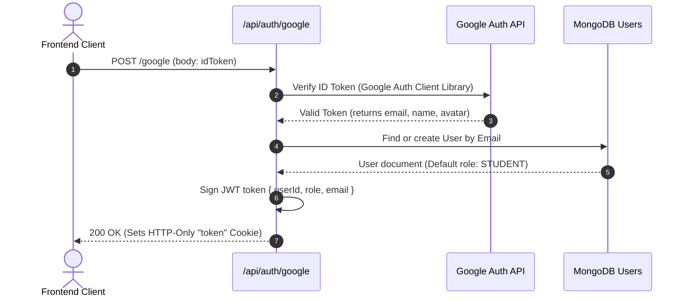
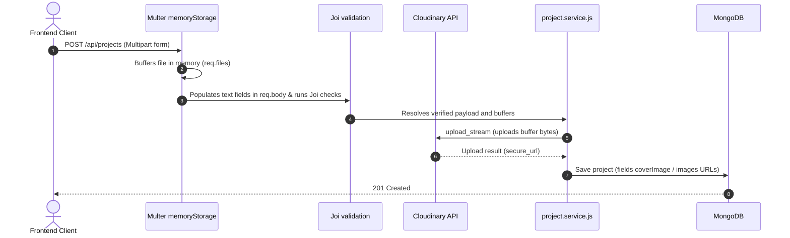

# System Architecture - Technical Specification

This document details the core architectural layers, interaction sequences, authentication, uploading, and notification structures.

---

## 1. Layered Architecture (Dependency Injection Flow)

The application follows clean layering separating HTTP transportation interfaces from database access schemas:

```
[Client App]
     │
     ▼
┌────────────────────────┐
│      Routes Layer      │  (Declares endpoints paths, mounts middlewares)
└──────────┬─────────────┘
           │
           ▼
┌────────────────────────┐
│   Controllers Layer    │  (Handles HTTP request/response parsing, sanitizations)
└──────────┬─────────────┘
           │
           ▼
┌────────────────────────┐
│     Services Layer     │  (Implements business rules, emits events, checks permissions)
└──────────┬─────────────┘
           │
           ▼
┌────────────────────────┐
│   Repositories Layer   │  (Database access abstraction - extends BaseRepository)
└──────────┬─────────────┘
           │
           ▼
┌────────────────────────┐
│      Models Layer      │  (Declares Mongoose database schemas)
└────────────────────────┘
```

---

## 2. Authentication Flow (Google OAuth & JWT)

Google Sign-In is executed as a token exchange flow returning stateless HTTP-Only JWT cookies:



---

## 3. Buffer Upload Flow (Cloudinary Stream)

Mutations uploading multipart files stream buffers straight to Cloudinary without writes to server disk space:



---

## 4. Event-Driven Notification System Flow

Every system-wide social action triggers in-memory notifications and audit logs asynchronously:

```mermaid
sequenceDiagram
    autonumber
    actor User as Liker User
    participant ProjectService as project.service.js
    participant EventEmitter as event-emitter.js
    participant NotifHandler as notification.handler.js
    participant LogHandler as activity-log.handler.js
    participant DB as MongoDB

    User->>ProjectService: Toggle Like /projects/:id/like
    ProjectService->>DB: Save Like connection
    ProjectService->>EventEmitter: emit('PROJECT_LIKED', payload)
    Note over ProjectService,EventEmitter: Asynchronous fire-and-forget
    ProjectService-->>User: 200 OK (Liked)

    par Notification Handler
        EventEmitter->>NotifHandler: PROJECT_LIKED listener fires
        NotifHandler->>DB: create Notification (recipient: owner, sender: liker)
    and Activity Log Handler
        EventEmitter->>LogHandler: PROJECT_LIKED listener fires
        LogHandler->>DB: create ActivityLog (user: liker, action: PROJECT_LIKED)
    end

---

## 5. Scalability

To support a growing user base of **100,000+ active users** and ensure fast, reliable performance, the system architecture incorporates several scalable design patterns:

### Database Indexing Strategy
MongoDB performance is optimized using targeted single and compound indexes designed around common query paths:
- **Compound Indexes:** `{ status: 1, createdAt: -1 }` accelerates paginated queries for active project listings, and `{ recipient: 1, isRead: 1 }` optimizes notification delivery for specific users.
- **Unique Indexes:** `{ user: 1, project: 1 }` (likes) and `{ follower: 1, following: 1 }` (follows) ensure integrity and speed up unique constraint lookups.
- **Full-Text Indexes:** A compound text index on `{ title: "text", description: "text" }` powers efficient search operations without resorting to expensive regex scans.

### Stateless JWT & Horizontal Scaling
Authentication relies entirely on stateless JSON Web Tokens (JWT) stored in HTTP-Only cookies. Because session state is not stored in memory on the application servers, the web server layer is completely stateless:
- **Load Balancing:** HTTP traffic can be horizontally scaled across multiple instances behind a load balancer (e.g., NGINX, AWS ALB).
- **Auto-scaling:** Application instances can scale up or down dynamically based on CPU/Memory load without requiring session synchronization or sticky sessions.

### Distributed Caching (Redis Integration Plan)
To prevent database bottlenecks under heavy read loads, a Redis caching layer can be introduced:
- **Notification Caching:** Caching unread notification counts (`/api/notifications/unread-count`) in Redis, with cache invalidation triggered on new event dispatches.
- **Active Project Caching:** Caching the first few pages of approved projects or frequently accessed public profiles to reduce MongoDB read IOPS.

### Image Optimization & CDN Delivery
Image handling avoids server disk storage by streaming uploaded buffers directly to Cloudinary:
- **Content Delivery Network (CDN):** Cloudinary serves images from edge caches distributed worldwide, minimizing latency for users.
- **On-the-Fly Optimization:** Images are retrieved with dynamic resizing and format optimization (e.g., converting to WebP) requested via Cloudinary URL parameters, reducing payload sizes for clients.
```
